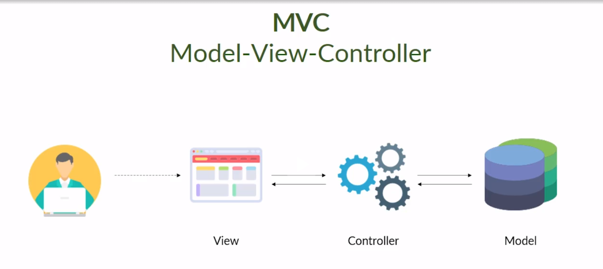

>Módulo de Banco de Dados e PHP do programa Devstart Paylivre.
 

- Projeto de construção de um e-commerce utilizando uma arquitetura MVC (Model, View e Controller) e o CRUD (Create, Read, Update e Delete). 
   

  - Criamos _rotas_, mostrando os caminhos a serem acessados pelo usuário; 
  - Criamos vários controllers usando classes e seu métodos, controlando as rotas, o acessao ao banco de dadas, a renderização e retorno ao usuário através das _Views_.
  - Criamos um banco de dados do zero, usando tabelas, preenchendo os dados e outros comandos usando o _Maria DB_.
  - Criamos relatório em PDF usando o _Composer_.
 

>**_ALuno:_**  
[Daniel Pinheiro Machado](https://www.linkedin.com/in/daniel-pinheiro-machado/)

>**_Facilitador:_**  
[Alessandro Feitosa](https://www.linkedin.com/in/alessandrofeitoza/)

 

- [Projeto E-commerce](/projeto-final/)
 

